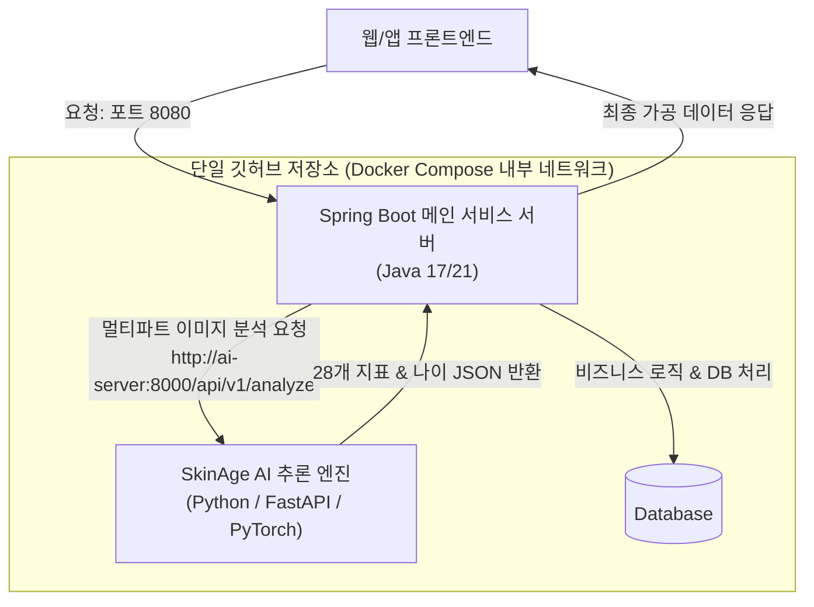

# Spring Boot 백엔드 × SkinAge AI 통합 개발 가이드
**문서 버전:** 1.0.0  
**대상자:** 서비스 백엔드 개발자 (Java / Spring Boot)  
**목적:** 단일 깃허브(GitHub) 저장소 제출 및 심사를 위한 Spring Boot + SkinAge AI 모노레포(Monorepo) 통합 및 API 연동 가이드  

---

## 1. 개요 및 아키텍처

심사/평가 환경에서 **단일 깃허브 저장소 주소 1개**로 전체 서비스를 제출하고, 심사위원이 `docker compose up` 명령어 한 줄로 Java 백엔드와 Python AI 서버를 동시에 구동할 수 있도록 구성하는 표준 아키텍처입니다.



---

## 2. 제공된 압축파일(`SkinAge_AI_Package.zip`) 배치 방법

전달받으신 **`SkinAge_AI_Package.zip`**은 AI 서버 구동에 필요한 소스코드, 딥러닝 학습 가중치(`best_model.pth`), 설정 및 Dockerfile이 완벽하게 포함된 독립 패키지입니다.

### 📌 3단계 적용 가이드:
1. **Spring Boot 프로젝트 루트 디렉토리**로 이동합니다.
2. 루트에 **`ai/`** 폴더를 생성합니다.
3. `SkinAge_AI_Package.zip`의 압축을 **`ai/`** 폴더 안에 풉니다.

```text
root-repository/ (Spring Boot 레포지토리 루트)
├── docker-compose.yml                <-- ⭐️ 아래 4.3절의 내용을 복사하여 생성
├── README.md                         <-- 전체 프로젝트 소개 및 실행 가이드
├── backend/ (또는 src/ 및 build.gradle) <-- 기존 Spring Boot 프로젝트
└── ai/                               <-- ⭐️ SkinAge_AI_Package.zip 압축 해제 위치
    ├── src/                          <-- AI 모델, 전처리, FastAPI 서버 소스코드
    ├── config/                       <-- 모델 및 API 설정 YAML
    ├── docs/                         <-- 연동 명세서 및 가이드
    ├── outputs/models/best_model.pth <-- 학습 완료된 딥러닝 모델 가중치 (134MB)
    ├── Dockerfile                    <-- AI 서버 도커 빌드 파일
    └── requirements.txt              <-- 파이썬 라이브러리 의존성
```

---

## 3. Spring Boot Java 연동 코드 (즉시 복사 가능)

### 3.1. Java DTO / Record 클래스 정의

SkinAge가 반환하는 순수 피부 분석 데이터 스키마와 1:1 매핑되는 DTO입니다.

```java
package com.example.service.dto.skinage;

import java.util.List;
import java.util.Map;

// 1. 최상위 응답 객체
public record SkinAnalysisResponse(
    SummaryMetrics summary,
    List<ZoneScoreDto> zoneScores,
    AggregateMetricsDto aggregateMetrics,
    ProcessingMetadataDto metadata,
    Double predictedAge,     // 편의용 alias
    Double ageDelta,         // 편의용 alias
    Double overallScore      // 편의용 alias
) {}

// 2. 거시 지표 요약
public record SummaryMetrics(
    double predictedSkinAge,
    Integer actualAge,
    Double ageDelta,
    double overallScore,
    String skinHealthGrade
) {}

// 3. 7개 부위별 세부 지표
public record ZoneScoreDto(
    String zone,
    double compositeScore,
    String label,
    double occlusionConfidence,
    List<ConcernDetailDto> concerns
) {}

// 4. 부위별 4대 고민 세부 점수
public record ConcernDetailDto(
    String concern,     // "wrinkle", "pore_texture", "pigmentation", "redness"
    double score,       // 0.0 ~ 100.0
    String severity     // "minimal", "mild", "moderate", "significant"
) {}

// 5. 부위별 집계 통계 및 취약 부위 순위
public record AggregateMetricsDto(
    double tZoneScore,
    double uZoneScore,
    Map<String, Double> concernAverages,
    List<PriorityConcernDto> priorityConcerns
) {}

// 6. 취약 부위 우선순위 아이템
public record PriorityConcernDto(
    int rank,
    String zone,
    String concern,
    double score,
    String severity
) {}

// 7. 처리 메타데이터
public record ProcessingMetadataDto(
    double processingTimeMs,
    String modelVersion,
    String device,
    int inputSize
) {}
```

---

### 3.2. AI 서버 호출 클라이언트 서비스 (`SkinAgeClient.java`)

Spring Boot 3.x의 최신 `RestClient`를 사용한 호출 서비스 구현 예시입니다. (Spring Boot 2.x인 경우 `RestTemplate` 또는 `WebClient` 사용 가능)

```java
package com.example.service.client;

import com.example.service.dto.skinage.SkinAnalysisResponse;
import org.springframework.beans.factory.annotation.Value;
import org.springframework.http.MediaType;
import org.springframework.http.client.SimpleClientHttpRequestFactory;
import org.springframework.stereotype.Service;
import org.springframework.util.LinkedMultiValueMap;
import org.springframework.util.MultiValueMap;
import org.springframework.web.client.RestClient;
import org.springframework.web.multipart.MultipartFile;

import java.time.Duration;

@Service
public class SkinAgeClient {

    private final RestClient restClient;

    public SkinAgeClient(@Value("${skinage.api.url:http://localhost:8000}") String aiServerUrl) {
        // AI 추론 소요 시간을 고려하여 타임아웃 10초 설정
        SimpleClientHttpRequestFactory factory = new SimpleClientHttpRequestFactory();
        factory.setConnectTimeout((int) Duration.ofSeconds(5).toMillis());
        factory.setReadTimeout((int) Duration.ofSeconds(10).toMillis());

        this.restClient = RestClient.builder()
                .baseUrl(aiServerUrl)
                .requestFactory(factory)
                .build();
    }

    /**
     * 사용자가 업로드한 얼굴 이미지를 SkinAge AI 서버로 전송하여 분석 결과를 반환받습니다.
     *
     * @param file 사용자 얼굴 이미지 파일
     * @param age 사용자 실제 나이 (선택)
     * @return 28개 지표 및 피부 나이 분석 결과 DTO
     */
    public SkinAnalysisResponse analyzeSkin(MultipartFile file, Integer age) {
        MultiValueMap<String, Object> body = new LinkedMultiValueMap<>();
        body.add("file", file.getResource());
        if (age != null) {
            body.add("age", age);
        }
        body.add("include_heatmaps", false);

        return restClient.post()
                .uri("/api/v1/analyze")
                .contentType(MediaType.MULTIPART_FORM_DATA)
                .body(body)
                .retrieve()
                .body(SkinAnalysisResponse.class);
    }
}
```

---

### 3.3. `application.yml` 환경 설정

```yaml
# application.yml
skinage:
  api:
    # 로컬 개발 시에는 localhost:8000, 도커 환경에서는 환경변수로 http://ai-server:8000 주입
    url: ${SKINAGE_API_URL:http://localhost:8000}
```

---

## 4. Docker & Docker Compose 설정 (심사위원 배포용)

### 4.1. `ai/Dockerfile` (SkinAge AI 서버용)

```dockerfile
FROM python:3.11-slim

# OpenCV 및 MediaPipe 필수 시스템 패키지 설치
RUN apt-get update && apt-get install -y --no-install-recommends \
    libgl1-mesa-glx \
    libglib2.0-0 \
    build-essential \
    && rm -rf /var/lib/apt/lists/*

WORKDIR /app

# 파이썬 의존성 설치
COPY requirements.txt .
RUN pip install --no-cache-dir -r requirements.txt

# 소스코드 및 학습 모델 복사
COPY src/ ./src/
COPY config/ ./config/
COPY outputs/ ./outputs/

EXPOSE 8000

CMD ["python", "-m", "uvicorn", "src.api.app:create_app", "--factory", "--host", "0.0.0.0", "--port", "8000"]
```

---

### 4.2. `backend/Dockerfile` (Spring Boot 서버용)

```dockerfile
# 1단계: Gradle 빌드
FROM gradle:8.5-jdk17 AS builder
WORKDIR /app
COPY build.gradle settings.gradle ./
COPY src ./src
RUN gradle bootJar --no-daemon

# 2단계: 경량 실행 환경
FROM openjdk:17-slim
WORKDIR /app
COPY --from=builder /app/build/libs/*.jar app.jar

EXPOSE 8080

ENTRYPOINT ["java", "-jar", "app.jar"]
```

---

### 4.3. 루트 경로 `docker-compose.yml`

```yaml
version: '3.8'

services:
  # 1. SkinAge AI 서버
  ai-server:
    build:
      context: ./ai
      dockerfile: Dockerfile
    container_name: skinage-ai-server
    ports:
      - "8000:8000"
    restart: unless-stopped

  # 2. 메인 Spring Boot 서비스 서버
  backend-server:
    build:
      context: ./backend
      dockerfile: Dockerfile
    container_name: service-backend-server
    ports:
      - "8080:8080"
    depends_on:
      - ai-server
    environment:
      - SKINAGE_API_URL=http://ai-server:8000
    restart: unless-stopped
```

---

## 5. 로컬 개발 및 테스트 방법

### 옵션 A: Docker Compose로 전체 원클릭 실행 (심사위원 실행 방식)
```bash
# 루트 디렉토리에서 실행
docker compose up --build
```
* Spring Boot 서비스: `http://localhost:8080`
* SkinAge AI Swagger UI: `http://localhost:8000/docs`

---

### 옵션 B: 로컬에서 개발 시 개별 실행
1. **SkinAge AI 서버 실행** (터미널 1):
   ```bash
   cd ai
   python -m uvicorn src.api.app:create_app --factory --port 8000 --reload
   ```
2. **Spring Boot 실행** (터미널 2 또는 IntelliJ IDE):
   ```bash
   cd backend
   ./gradlew bootRun
   ```

---

## 6. 문의 및 API 명세 참조
* 세부 필드 규격 및 데이터 딕셔너리: [`INNERDERMA_API_SPEC.md`](./INNERDERMA_API_SPEC.md) 참조
